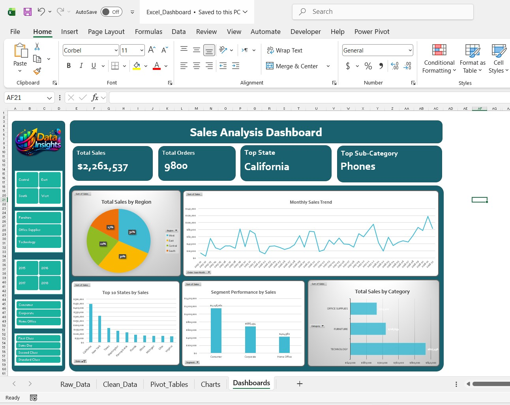
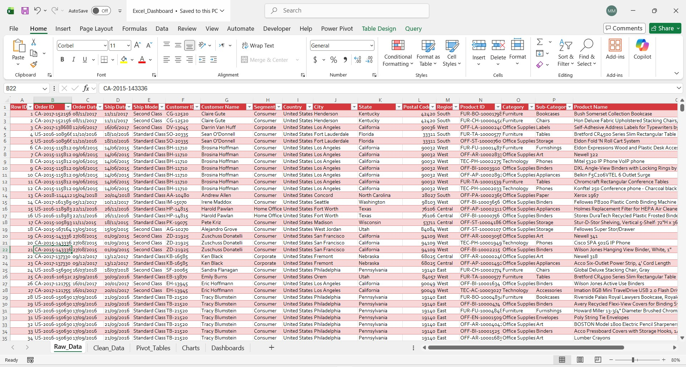

# 📊 Superstore Sales Excel Dashboard

## 📌 Project Overview
This project is an Excel dashboard built using a Superstore sales dataset. It focuses on cleaning raw sales data, creating helper columns, building PivotTables, and designing a simple interactive dashboard to highlight sales trends and performance.

## Dashboard Preview

## Raw Data Preview

## 🎯 Objectives
- Clean and structure raw sales data in Excel
- Create time-based helper columns for analysis
- Build PivotTables for regional, category, segment, and shipping analysis
- Design a dashboard with KPI cards, charts, and slicers
- Present clear business insights in a simple and professional format

## 🛠 Tools Used
- Microsoft Excel
- PivotTables
- Pivot Charts
- Slicers
- Formulas and helper columns

## 📂 Dataset
The raw dataset includes fields such as:
- Order Date
- Ship Date
- Ship Mode
- Segment
- Country
- City
- State
- Region
- Category
- Sub-Category
- Product Name
- Sales

## 🗂 Project Structure
- **Raw_Data**: original imported CSV data
- **Clean_Data**: cleaned version of the dataset with helper columns
- **Pivot_Tables**: analysis tables used to summarize the data
- **Dashboard**: final dashboard with KPIs, charts, and slicers

## 🔧 Helper Columns Created
The following helper columns were added to support analysis:
- Order Year
- Order Month
- Month Number
- Quarter
- Order Year-Month
- Ship Days
- Sales Group

## 📊 Analysis Included
The dashboard analyzes:
- Total sales by region
- Total sales by category
- Total sales by sub-category
- Monthly sales trends
- Segment performance
- Ship mode performance
- Geographic sales distribution
- Sales band analysis

## 📈 Key KPIs
Examples of KPI cards included in the dashboard:
- Total Sales
- Total Orders
- Top State
- Top Sub-Category

## ⭐ Key Features
- Clean and structured Excel workbook
- Interactive slicers for filtering
- Easy-to-read dashboard layout
- Strong use of PivotTables and charts
- Suitable for portfolio and interview presentation

## 💡 Business Value
This project demonstrates how Excel can be used to transform raw sales data into actionable business insights through data cleaning, analysis, and dashboard design.

## 📁 Files Included
- `Data folder (inlcudes raw data file)`
- `Excel folder (includes the main excel file)`
- `Images (includes preview images)`
- `README.md`
